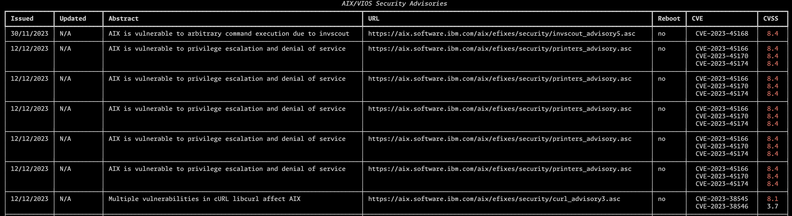

# AIX/VIOS Security Advisories

This script takes the JSON data provided at [https://esupport.ibm.com/customercare/flrt/doc?page=aparJSON](https://esupport.ibm.com/customercare/flrt/doc?page=aparJSON) and produces a table of AIX/VIOS security advisories.



## Table of contents

* [Usage](#usage)
* [Requirements](#requirements)
* [Contributing](#contributing)
* [License](#license)
* [Contact](#contact)

## Usage

```text
./aix_security_advisories.py --help
usage: aix_security_advisories.py [-h] [--days DAYS] [--file FILE] [--insecure]

Produces a table of AIX/VIOS advisories

options:
  -h, --help   show this help message and exit
  --days DAYS  Show advisories issued and/or updated in the past number days.
  --file FILE  File containing JSON data.
  --insecure   Ignore HTTPS insecure request warnings.
```

By default, the script will print a table containing advisories issued in the past 14 days (date format `%d/%m/%Y`), and can be overriden using `--days`. If you cannot directly reach [https://esupport.ibm.com/customercare/flrt/doc?page=aparJSON](https://esupport.ibm.com/customercare/flrt/doc?page=aparJSON), you can pass the JSON data file as an input to the script with `--file`.

CVE's with a CVSS score >= 8, will be highlighted in red.

## Requirements

### Python

The script is written in Python 3 (tested with 3.11.7), and relies on the following external packages.

* requests
* rich

Creating a python virtual environment is recommended.

```text
python3 -m venv .venv
source .venv/bin/activate
pip install -r requirements.txt
```

## Contributing

First are foremost, I'm a novice (at best) with Python. There are likely better, more secure, and more concise ways of achieving what this script does. I very much welcome pull request for either code enhancements, or to add features. If anything, to help me learn.

## License

Distributed under the GPL-3.0 license. See `LICENSE` for more information.

## Contact

Kristian Milos - [@Kristijan](https://infosec.exchange/@kristijan)
